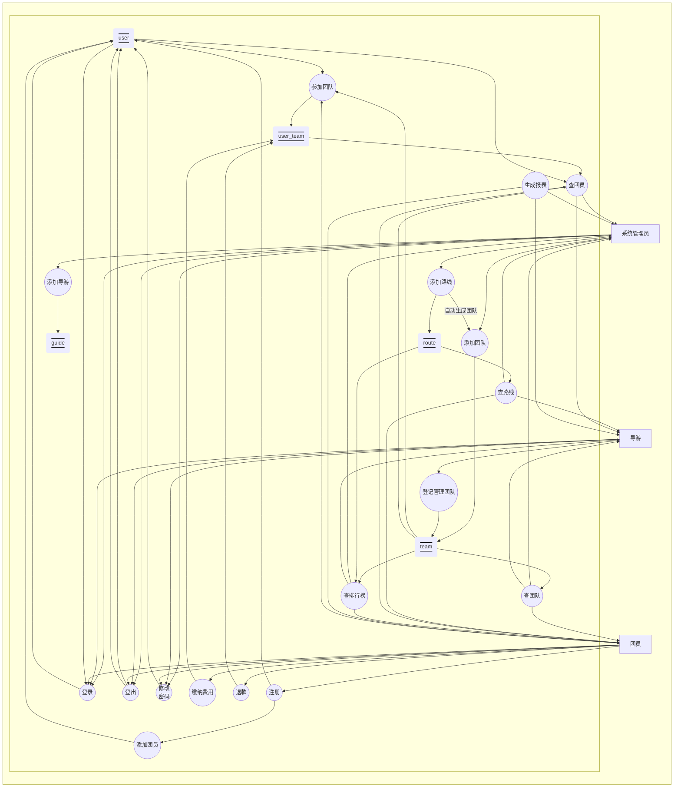
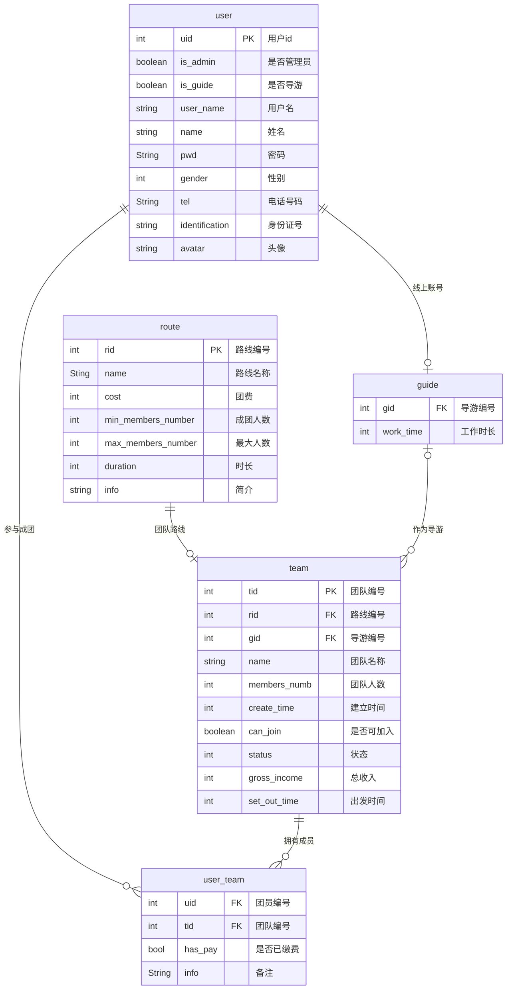
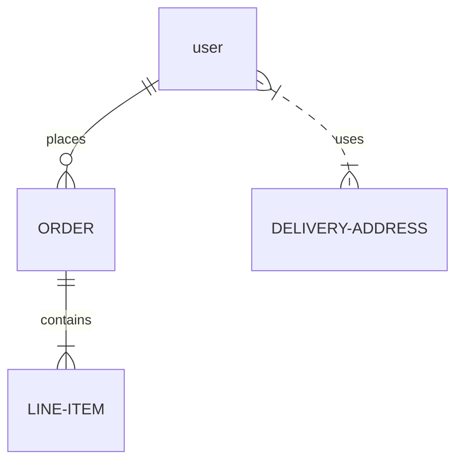

# 旅行社信息管理系统ER图

```mermaid

flowchart LR
classDef c1 stroke:none
t_user("<div style='border-top:2px solid black;border-bottom:2px solid black;'>user<div/>"):::c1
t_team("<div style='border-top:2px solid black;border-bottom:2px solid black;'>team<div/>"):::c1
t_user_team("<div style='border-top:2px solid black;border-bottom:2px solid black;'>user_team<div/>"):::c1
t_guide("<div style='border-top:2px solid black;border-bottom:2px solid black;'>guide<div/>"):::c1
t_route("<div style='border-top:2px solid black;border-bottom:2px solid black;'>route<div/>"):::c1

e_admin[系统管理员]
e_guide[导游]
e_user[团员]
subgraph " "
    e_user --> a_signup((注册))
    a_login((登录))
    a_change_pw((修改<br/>密码))
    a_logout((登出))
        e_admin & e_guide & e_user --> a_login & a_logout & a_change_pw

    a_add_route((添加路线))
    a_add_team((添加团队))
    a_add_guide((添加导游))
        e_admin --> a_add_route & a_add_team & a_add_guide
     
    e_user --> a_join_team((参加团队))
    e_user --> a_pay((缴纳费用))
    e_user --> a_refund((退款))
    e_guide --> a_guide_team((登记管理团队))

    a_query_team((查团队)) --> e_admin & e_guide & e_user
    a_query_route((查路线)) --> e_admin & e_guide & e_user
    a_query_user((查团员)) --> e_admin & e_guide & e_user
    a_query_rank((查排行榜)) --> e_admin & e_guide & e_user
    a_report((生成报表))       --> e_admin & e_guide & e_user
subgraph " "
    a_login & a_logout & a_change_pw --> t_user
    t_user --> a_login
    a_signup --> a_add_user((添加团员)) --> t_user
    a_signup --> t_user
    a_logout --> t_user
    a_add_route --> t_route
    a_add_route -- 自动生成团队 --> a_add_team
    a_add_team --> t_team
    a_add_guide --> t_guide
    a_guide_team --> t_team

    t_user & t_team --> a_join_team --> t_user_team   
    a_pay --> t_user_team
    a_refund --> t_user_team

    t_team --> a_query_team
    t_route --> a_query_route
    t_team & t_user_team & t_user --> a_query_user
    t_team & t_route --> a_query_rank
    a_report


    %%    t_user -- 权限查询 --> a_add_team & a_add_user & a_add_guild & a_add_route & a_query_team & a_query_route & a_query_user & a_query_rank
end
end
```

```mermaid
erDiagram
    user ||--o| guide : "线上账号"
    user ||--o{ user_team : "参与成团"
    team ||--o{ user_team : "拥有成员"
    route ||--o| team : "团队路线"
    guide |o--o{ team : "作为导游"
    user {
         int uid PK "用户id"
         boolean is_admin "是否管理员"
         boolean is_guide "是否导游"
         string user_name "用户名"
         string name "姓名"
         String pwd "密码"
         int gender "性别"
         String tel "电话号码"
         string identification "身份证号"
         string avatar "头像"
    }
    user_team {
        int uid FK "团员编号"
        int tid FK "团队编号"
        bool has_pay "是否已缴费"
        String info "备注"
    }
    team {
        int tid PK "团队编号"
        int rid FK "路线编号"
        int gid FK "导游编号"
        string name "团队名称"
        int members_numb "团队人数"
        int create_time "建立时间"
        boolean can_join "是否可加入"
        int status "状态"
        int gross_income "总收入"
        int set_out_time "出发时间"
    }
    route{
        int rid PK "路线编号"
        Sting name "路线名称"
        int cost "团费"
        int min_members_number "成团人数"
        int max_members_number "最大人数"
        int duration "时长"
        string info "简介"
    }
    guide {
        int gid FK "导游编号"
        int work_time "工作时长"
    }

```

```mermaid
erDiagram
    user ||--o{ ORDER : places
    ORDER ||--|{ LINE-ITEM : contains
    user }|..|{ DELIVERY-ADDRESS : uses
```

